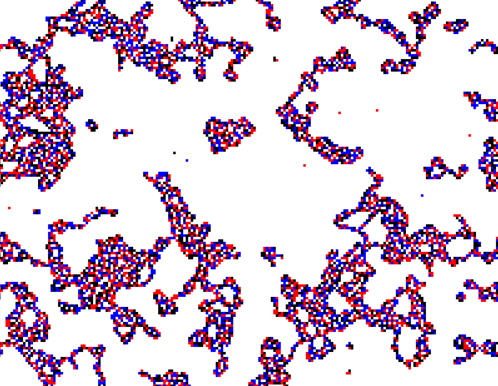
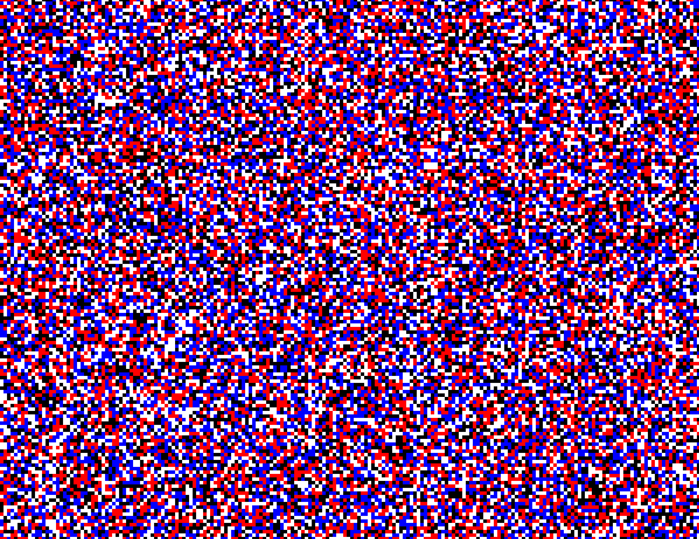

# Catus Koti Cellular Automata

Cellular Automations using Catus Koti (4 state) elements.

This is a code stash, I plan on actually iterating through all possible rules and observing resulting patterns.

# Examples Outputs

